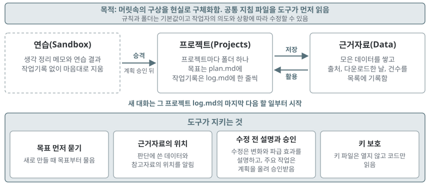

# Your Usable Reality of Ideas_Lite - 당신의 구상을 현실로

Your Usable Reality of Ideas에서 체계를 줄이고 꼭 필요한 것만 남긴 작업 공간이다. 목적은 같다. **작업하는 사람의 머릿속에 있는 구상을 현실로 구체화하는 것**이다. 이 폴더를 Antigravity IDE 같은 도구로 통째로 열고 쓴다.

- 네 줄 작업기록, 데일리 노트, 주간 점검, 작업 단위와 시작 프롬프트까지 갖춘 Your Usable Reality of Ideas: https://github.com/pnumksong/Your_Usable_Reality_of_Ideas

## 다운로드

1. 저장소 화면의 Code 단추에서 Download ZIP을 누르거나 `git clone`으로 다운로드한다.
2. 압축은 바탕화면이나 문서 폴더처럼 짧은 경로에 푼다(Windows는 경로가 너무 길면 파일을 만들지 못함).
3. 이 README가 바로 보이는 폴더를 Antigravity IDE, Claude Code, Codex 같은 도구로 열고(Codex는 이 폴더 맨 위에서 실행해야 지침을 읽음), 첫 요청으로 「이 작업 공간이 어떻게 돌아가는지 설명해 줘」를 넣는다.

## 남긴 것

| 폴더 | 하는 일 |
|---|---|
| `AGENTS.md`, `CLAUDE.md` | 공통 지침(목적, 규칙, 체계 수정). 도구가 먼저 읽는다. 두 파일은 내용이 같다 |
| `Projects/` | 프로젝트마다 폴더 하나. 목표는 `plan.md`, 작업기록은 `log.md`에 한 줄씩. 가이드나 논문 같은 참고자료는 그 폴더에 두거나 `plan.md`에 주소를 적는다 |
| `Data/` | 근거자료 중 모은 데이터와 그 출처 목록(`Data/README.md`) |
| `Sandbox/` | 연습과 생각 정리. 작업기록을 남기지 않고 지워도 된다 |

## Lite 버전에서 달라진 점

- 네 줄 작업기록 대신 한 줄 로그(`log.md`)를 쓰고, 데일리 노트, 주간 점검, 프로젝트별 지침, 참고자료 폴더, 예시 프로젝트가 없다.
- 도구가 따르는 핵심 규칙은 기본 버전과 같다.
  - 작업마다 판단의 근거로 쓴 근거자료의 위치를 알려 준다.
  - 새로 무엇을 만들 때는 목표를 먼저 묻는다.
  - 파일을 수정할 때는 예상되는 변화와 파급 효과를 설명하고 승인을 요청한다.
  - 체계 수정을 비롯한 주요 작업은 계획을 먼저 올리고 작업자가 직접 승인한 뒤 진행한다.
  - 새 대화는 그 프로젝트 `log.md`의 마지막 다음 할 일부터 시작한다.
- 그 밖에 승격과 Sandbox 참조 금지, 참조 표시, 제출본 사본, 키 파일 보호, 설치 확인 규칙이 `AGENTS.md`에 있다.
- 이 규칙과 폴더는 기본값이며, 작업자의 의도와 상황에 따라 구조를 얼마든지 수정할 수 있다.
- 체계가 필요해지면 Your Usable Reality of Ideas의 해당 부분을 가져와 쓴다.

## 시작해보기

- 「이 작업 공간이 어떻게 돌아가는지 설명해 줘」
- 「새 프로젝트를 만들고 싶어. 목표부터 물어봐 줘」
- 「Projects의 ○○ 폴더에서 국가서지 LOD의 관심 분야 책 20건을 다운로드해 Data에 저장해 줘. 다운로드하기 전에 계획을 보여 줘」
- 「Projects의 ○○ 폴더의 log.md에서 다음 할 일부터 이어서 해 줘」

## 감사의 말

본 작업 폴더의 구상은 넥스트 제너레이션 아키비스트 클럽에서 시작하였으며, 스터디를 운영하고 아이디어를 주신 [ContextA](https://contexta.co.kr/)의 정혜지 대표님께 감사드립니다.
